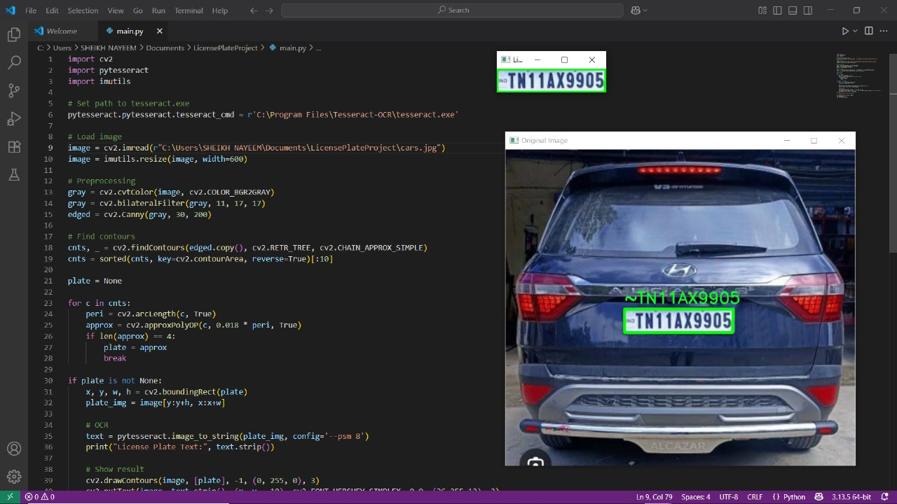

# LicensePlateRecognition
A Python project for automatic license plate detection using OpenCV and Tesseract OCR.
# License Plate Recognition using Python

This project detects and extracts license plate text from images using OpenCV and Tesseract OCR.

## 🔧 Technologies Used
- Python
- OpenCV
- Pytesseract
- Imutils

## 🚀 How it Works
1. Preprocess the image (grayscale, blur, edge detection)
2. Detect contours and locate license plate
3. Extract text using Tesseract OCR

## 🖼️ Example

## 🧠 Author
Arshiya Sheikh — B.Tech CSE, Anjuman College of Engineering & Technology, Nagpur
